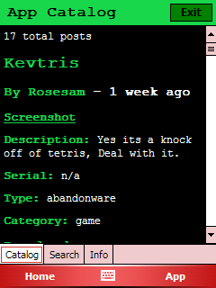
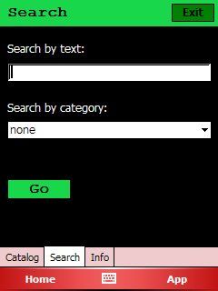
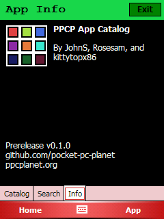

# Pocket PC Planet App Catalog

Easily find, download, and install Windows Mobile software, no computer required! The Pocket PC Planet App Catalog fetches items from Pocket PC Planet's software archive and displays them in a list optimized for Pocket PCs. PPCPAC is open source, and you can find the server-side portion of the code [here](https://github.com/pocket-pc-planet/surfers-side).

### Screenshots

### Resources
- [Server-Side Code](https://github.com/pocket-pc-planet/surfers-side)
- [Discord Server](https://discord.gg/tHbx4qc)
- [PPC Planet](https://ppcplanet.org/)

### Important
This program has replaced the old Pocket PC Planet App Manager project completely as of March 3, 2021. We're going to work on adding some of the App Manager's best features to the App Catalog in the future.
